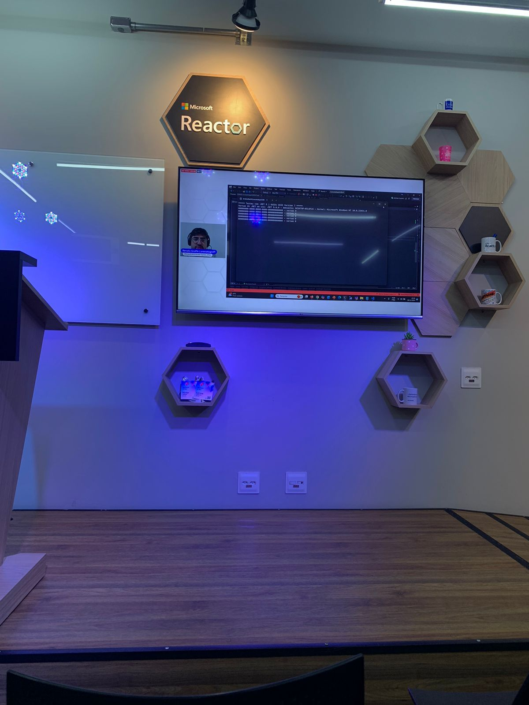
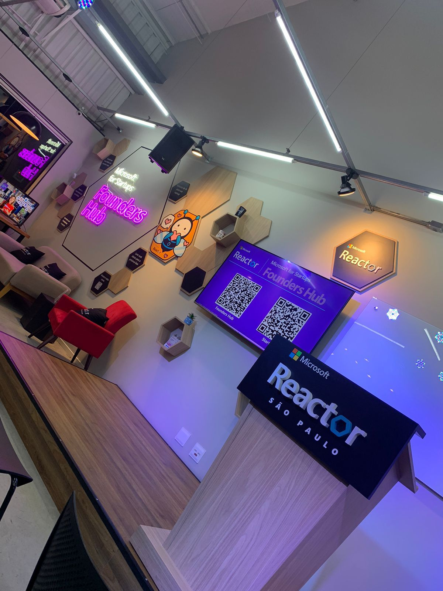
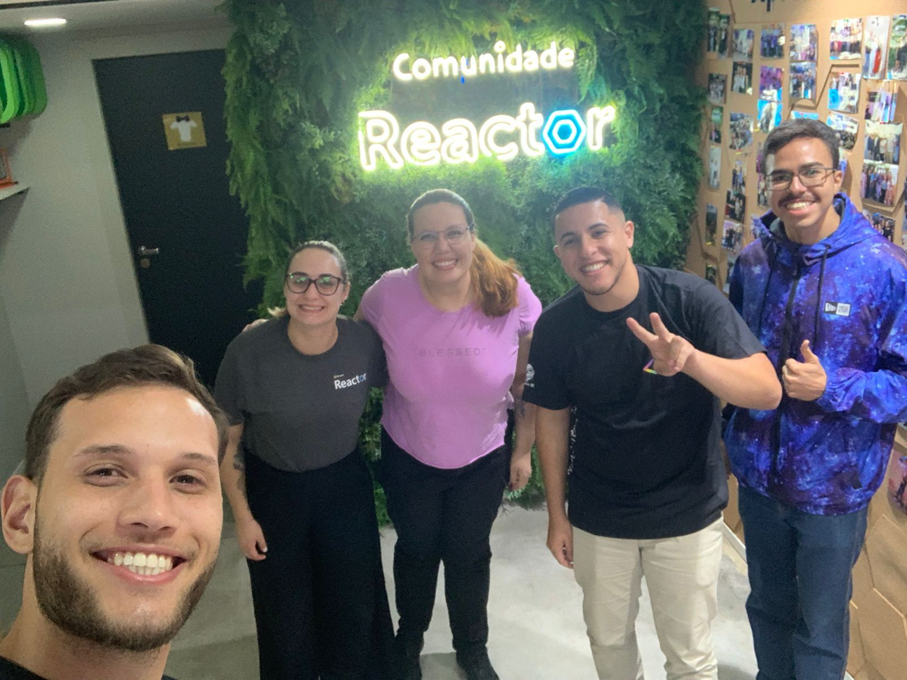
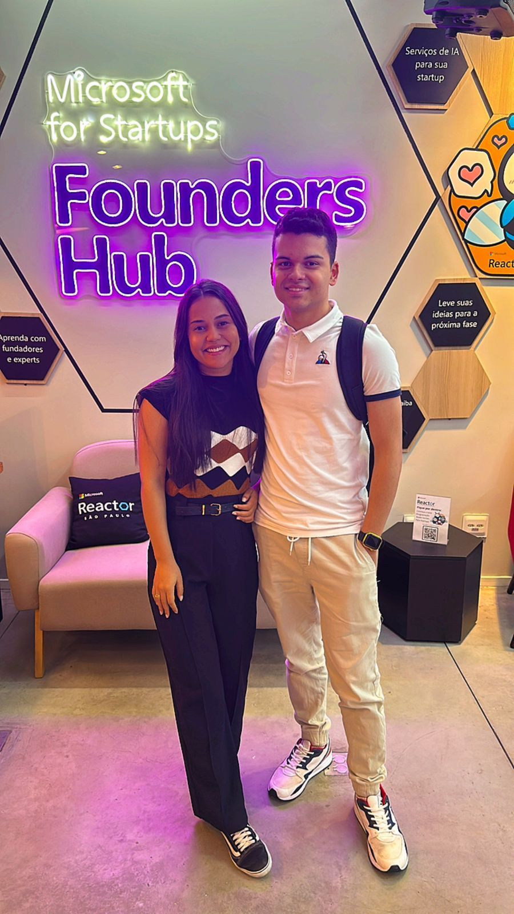
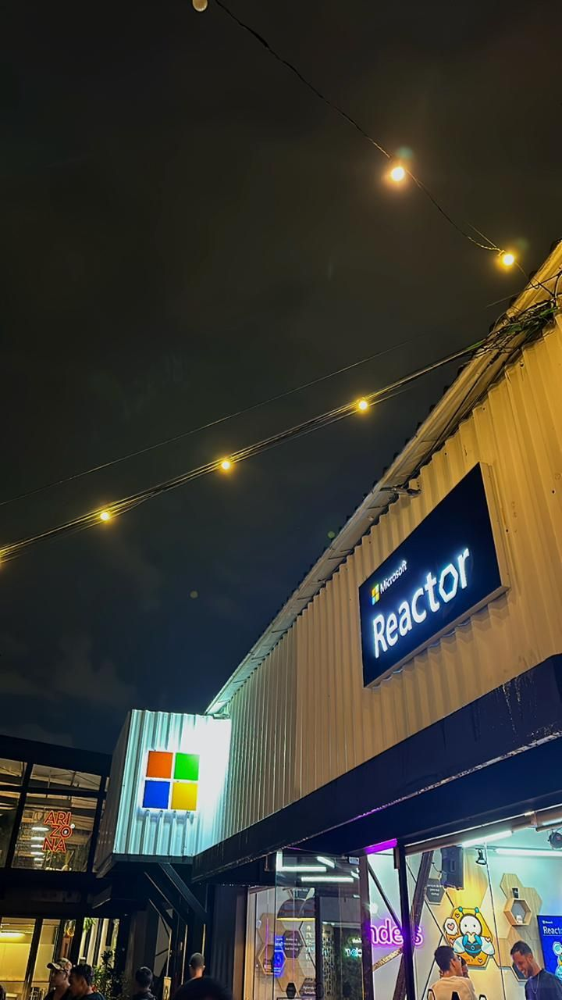
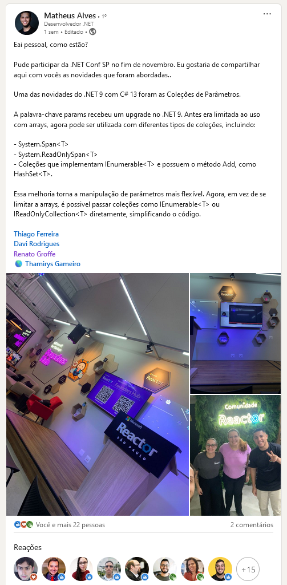
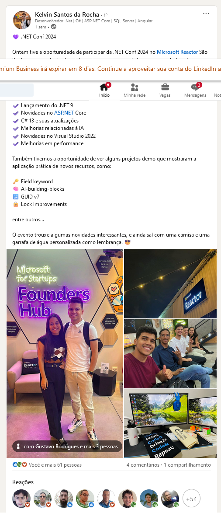
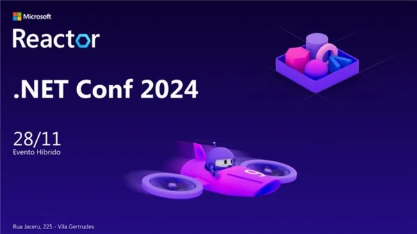

# DotNet9_2024-11
Exemplos de novos recursos do .NET 9 (incluindo C# 13) apresentados no dia 28/11/2024.

---

Link da transmissão: [**YouTube**](https://www.youtube.com/watch?v=nPc1PR4z5dw)

Formulário utilizado para inscrições: [**Microsoft Reactor**](https://developer.microsoft.com/pt-br/reactor/events/23704/?wt.mc_id=1reg_23704_webpage_reactor)

Local: **Microsoft Reactor - Rua Jaceru, 225 - Vila Gertrudes - São Paulo - SP - CEP: 04705-000**

Agradeço novamente à **Thamirys Gameiro (Microsoft MVP)**, ao **Victor Temple** e à **Larissa Cyganski** pela oportunidade e todo o apoio para que eu participasse de mais um evento no **Microsoft Reactor** em **São Paulo-SP**.

---

